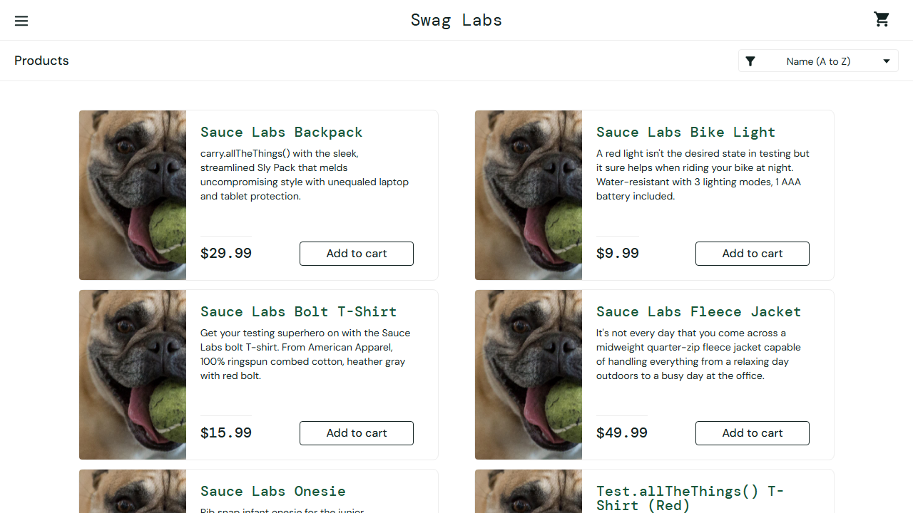

# BUG-001: Falha no carregamento de imagens de produtos

**Status:** Aberto
**Severidade:** Média
**Usuário afetado:** `problem_user`

### Descrição
Ao realizar login com o usuário `problem_user`, as imagens da vitrine de produtos não são carregadas corretamente, exibindo o placeholder de imagem quebrada.

### Passos para reproduzir
1. Acessar https://www.saucedemo.com/
2. Logar com `problem_user`
3. Observar a lista de produtos

### Resultado Esperado
As imagens específicas de cada produto devem ser exibidas.

### Resultado Atual
Todas as imagens apontam para o mesmo arquivo (dog-img), caracterizando falha de carregamento de assets.

**Evidência:** 